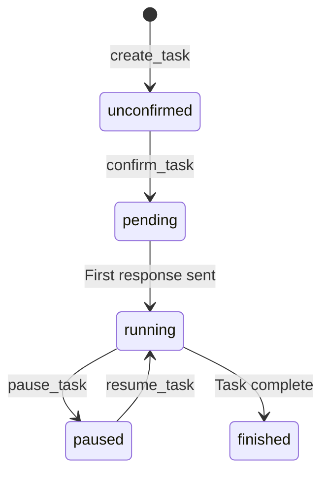

# Task System

Tasks are objectives Blady pursues on behalf of the user with specific contacts.

## State Diagram

## States

| Status | Description |
|--------|-------------|
| `unconfirmed` | Task created, awaiting user confirmation |
| `pending` | Confirmed, initial prompt being prepared |
| `running` | Active conversation with target contact |
| `paused` | Temporarily suspended by user |
| `finished` | Objective achieved |

## Storage

Tasks are stored as JSON files in `config/tasks/`. Deleted tasks move to `config/tasks/deleted/`.
